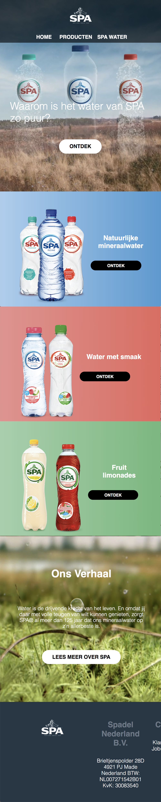
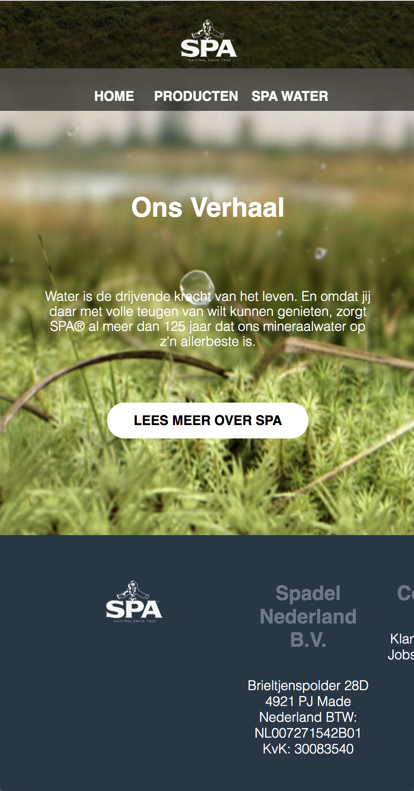
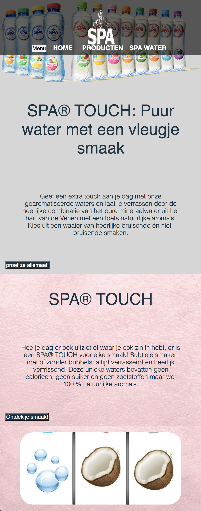
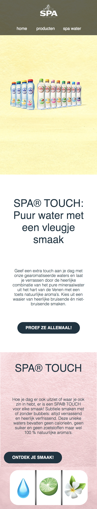
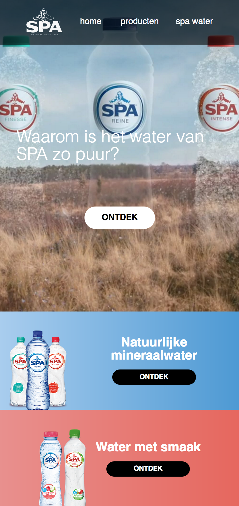
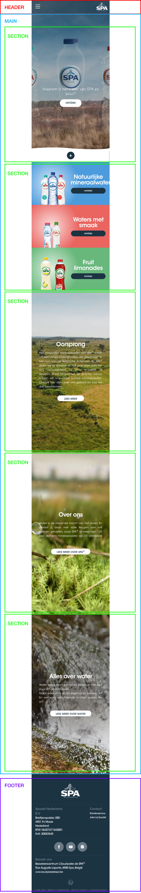
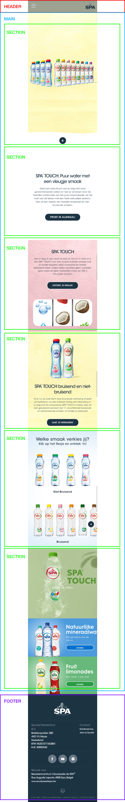
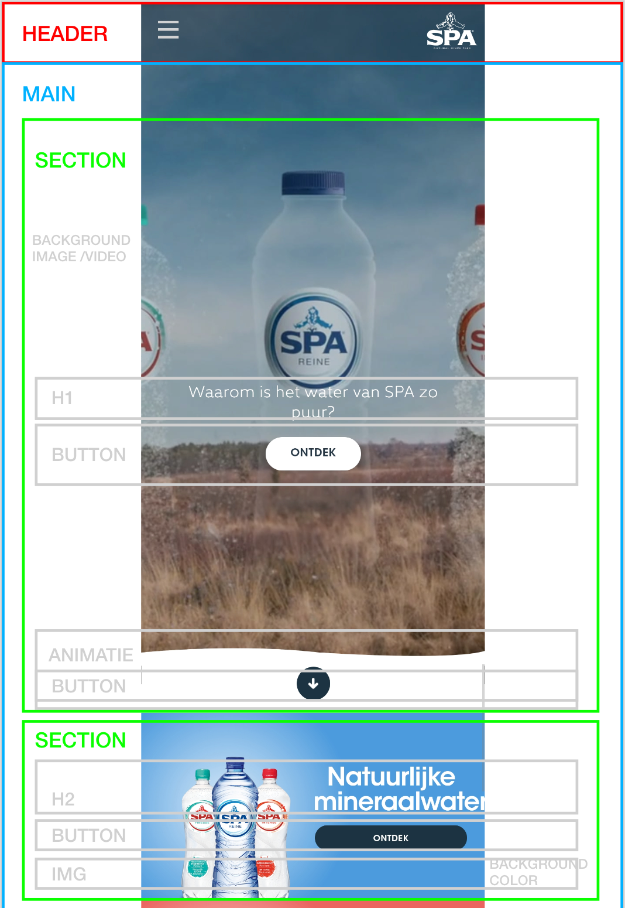
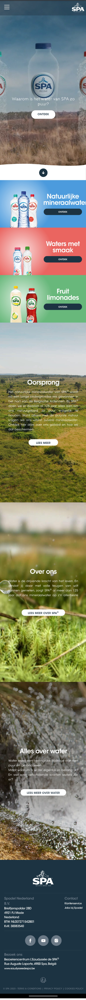
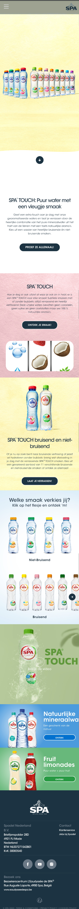

# Procesverslag
**Auteur:** -rosan gleijsteen-

Markdown cheat cheet: [Hulp bij het schrijven van Markdown](https://github.com/adam-p/markdown-here/wiki/Markdown-Cheatsheet). Nb. de standaardstructuur en de spartaanse opmaak zijn helemaal prima. Het gaat om de inhoud van je procesverslag. Besteedt de tijd voor pracht en praal aan je website.

## Bronnenlijst
1.https://www.spa.nl/
Al mijn beeldmateriaal komt van de website van Spa
2.www.google.com
Dit was mijn grootste vriend tijdens het coderen
3. https://codepen.io/rosangleijsteen/pen/qBaKZzP
Deze opdracht heeft me geholpen bij het maken van mijn hamburger menu.
Verder betreft coderen heb ik ook heel veel vanuit mijn vorige gemaakte websites van programmeren en internetstandaarden.

## Eindgesprek (week 7/8)

Ik had het onderschat. 
Zeker ook denk ik omdat ik bij programmeren en internetstandaarden heel veel hulp vroeg aan medestuderen. Maar ik had voor mezelf besloten dat ik wilde coderen dus dat ik deze website dan ook in mijn eentje (met de hulp van internet) ging maken. Dus ging zeker niet zonder slag of stoot. Maar gelukkig merkte ik wel door heel veel proberen herhalen en oefenen je daadwerkelijk beter wordt. Waarbij ik in het begin bijvoorbeeld telkens weer flexbox froggy ging spelen of even ging googlen hoe dat nou zat merkt ik nu dat ik dat toch ineens uit mijn hoofd begon te doen. 

Verder ben ik vooral super trots dat ik in 10 weken van niks aan een mooie website ben gegaan en dat ik mezelf heb overtroffen want ik had eigenlijk begin van de blok er niet zoveel vertrouwen in dat ik dit nu allemaal zou kunnen.

**Screenshot(s):**

## Toegankelijkheid verslag

Ik dacht dat ik het redelijk goed in elkaar had gezet. Tot je die vocie over aan zet echt denk huh wat bedoeld hij nu? 
Het was ten eerste ontzettend choatisch. Ik wist niet goed waar ik zat en wat het nou precies moest zijn. Ik kwam ook super veel uit op knoppen van chorme en tekstvlakken waar ik dan wat ik kon typen. 

Vooral denk ik dat ik mijn website kan verderen door echt goed naar die headinglevels te kijken en de afbeeldingen nog meer te omschrijven wat het nou precies is. 
Verder had ik wel het idee dat de knoppen wel lekker werkte hoewel het best fijn zou zijn als je ook meteen weer waar hij naar navigieerd en niet alleen weet wat er op staat.

## Voortgang 4 (week 7)

Ik ging zelfstandig verder met het verder ontwikkelen van de website. En dat ging zeker niet over roze geuren en manen schijnen. Wat liep ik toch veel vast. Gelukkig door heel veel oefenen en poberen heb ik toch een mooi eindresultaat kunnen halen. Hieronder zie je een schermafbeelding van de status waarbij ik vastliep met bepaalde responsive onderdelen en met het hamburger menu. 

__

Ik werdt eenbeetje boos omdat niks werkte dus ik had even de helft los getrokken en eerst gefocust op alleen de homepagina en op basis daarvan ben ik weer verder gegaan met het repareren van de detail pagina.

Hoe ik dit heb opgelost:
Voor het hamburger menu ben ik opnieuw de opdracht gaan uitvoeren van Mediaqueries 3 en door deze stap voor stap door te nemen heb ik mijn hamburger menu kunnen maken. Vervolgens ging ik goed mijn code doorlopen wat nou het pobleem was bij het responsive maken. Toen kwam ik er achter dat ik alle media queries in elkaar gezet had omdat ik de bovenste niet goed had afgesloten. Hierdoor dacht ik dat hij het deed, want al ik een kleur aanpaste deed hij het wel. Maar hierbij klopte de breakpoints niet (omdat mijn code steeds naar de bovenste keek). Maar toen ik dit eindelijk gevonden had kon ik gelukkig weer verder.

## Voortgang 3 (week 6)

Wegens hoge drukte tijds deze weken met andere vakken hebben we niet veel voortgang kunnen bespreken tijdens dit uur met de studenten assistenten. 

## Voortgang 2 (week 5)

### Stand van zaken

Ik vond het best wel lastig om vanuit niks te beginnen aan een ontwerp. Hierin heb ik vooral gekeken naar de codepen opdrachten en vorige HTML en CSS opdrachten van school. 

Wat goed ging was dat ik er uiteindelijk gelukkig uitkwam. Echter ging die niet zonder slag of stoot. Vooral het blok met de afbeelding links en de tekst en knop daarvan rechts vond ik nog redelijk lastig om te realiseren.

**Screenshot(s):**

Hier zie je het mobiele scherm waar ik tot nu toe ben. Het menu zou ik misschien wat anders willen en mogelijk toch een hamburger menu van maken. Daarnaast is hij best lang als jij bijvoorbeeld kijk op een IPhone SE scherm. Vooral de blokken (rood en blauw) was nog best lastig om te realiseren. Maar dat is gelukt dus waarschijnlijk moet de rest (met misschien wat hulp) ook helemaal goed komen.

Hier zie je hoe de website er nu uitziet als je de website op desktop ziet. Ik ben hier zeker niet ontevreden over echter kan er nog wat verbeteringen doorgevoerd worden. 

Ik ben vervolgens ook verder gegaan met het uitwerken van het tweede scherm. Hierbij moet ik nog wat aanpassingen doorvoeren op basis van responsive ontwerp.

### Agenda voor meeting

-samen met je groepje opstellen-

| Thijs Berrevoets     | Zahra Ahmadi         | Rosan Gleijsteen   | student 4        |
| ---            | ---                | ---          | ---              |
| Geen vragen meer tonen van stand van zaken | Horizontaal scrollen            | Hamburger menu doet het niet goed   | even overleggen over responsive ontwerp   |
| an dat ook nog | dit als er tijd is | responsive afbeeldingen | dit wil ik zeker |
| ...            | ...                | ...          | ...              |

### Verslag van meeting
Naar mijn mening verliep de meeting voorspoedig. Ik vroeg me af of ik mijn website tot nu toe al redelijk responsive had gemaakt. Hierbij kreeg ik als tip dat ik een goed begin had en vooral goed moet kijken wanneer iets er niet meer mooi uitziet en veel loze ruimte heeft dat ik dan met media qeury meet breakpoints moet maken zodat dit beter staat. Dus als iets niet meer mooi is, dan oas je dit aan. Daarnaast vroeg ik me erg af wat de toegevoegde waarde is van een hamburger menu op mijn website omdat je natuurlijk maar 2 pagina's heb. Hierop kreeg ik de tip om te kijken wat een goede toevoeging is voor de website. Het is vooral belangrijk dat je kan aantonen dat je met JavaScript kan werken. En dat dit toegepast is in de website. Verder maakt het niet uit of dit een hamburger menu is. Of dat het een soort winkelwagen in dat je zodra je op een flesje klikt je een animatie krijg waarbij je product in een winkelwagetje gaat.

## Voortgang 1 (week 3)

### Stand van zaken

Ik heb nu een redelijke basis staan hoewel er nog wel veel is wat ik moet doen. Ik vindt het belangrijk om te blijven richten op responsive en het toepassen van de media qeurys. Verder wilde ik ook graag een tweede pagina toevoegen en deze via de buttons en het menu te koppelen.

**Screenshot(s):**

Hier zie je dat ik extra blokken heb toegevoegd en het steeds meer een echte website begint te worden.

Ik heb me ook veel gericht op de desktop versie. Hierbij heb ik de 3 blokken van de producten naast elkaar gezet, en geprobeerd de rest ook mooi te positioneren.

### Agenda voor meeting

-samen met je groepje opstellen-

| Thijs Berrevoets     | Zahra Ahmadi         | Rosan Gleijsteen   | student 4        |
| ---            | ---                | ---          | ---              |
| Eerste afbeelding?  | Horizontaal scrollen            | Hamburger menu    | en dan ik dat    |
| an dat ook nog | dit als er tijd is | responsive afbeeldingen | dit wil ik zeker |
| ...            | ...                | ...          | ...              |

### Verslag van meeting
De meeting verliep redelijk snel. Ik had niet extreem moeilijke struikelpunten. De studentenassistenten hadden voor het hamburger menu geadviseerd te kijken naar de JS codepen opdracht en uitgelegd dat ik op deze manier ook een class kan aannoemen zodra je op een button klikt. En dit zorgt dat een menu verschijnt.

Verder kreeg ik als tip om te kijken naar CSS animaties als ik iets meer interactie in mijn website wil maken. En ze adviseerde het niet al te moeilijk te maken en vooral richt op een goede basis en vanuit daar verder kijken naar opties.

## Breakdownschets (week 1)

-uitwerken voor de 1e werkgroep - eind van de eerste week-
!!!fix je h1 etz!!!

## Intake (week 1)
-uitwerken voor de kick-off werkgroep - begin van de eerste week-

**Je startniveau:** -blauw-

**Je focus:** -kies uit responsive en met extra tijd uitwerking van surfplane-

**Je opdracht:** -https://www.spa.nl/-

**Screenshot(s) van de eerste pagina (small screen):**

**Screenshot(s) van de tweede pagina (small screen):**

